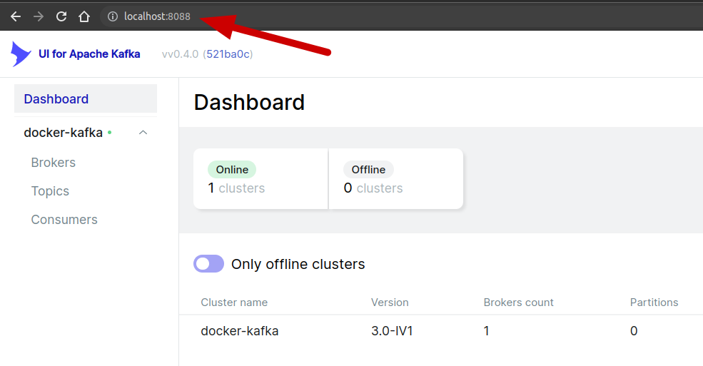
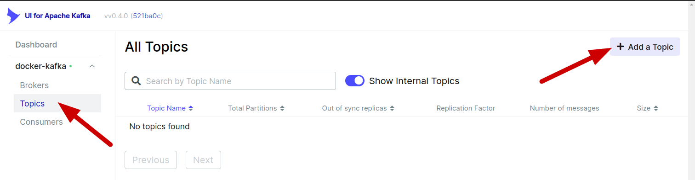
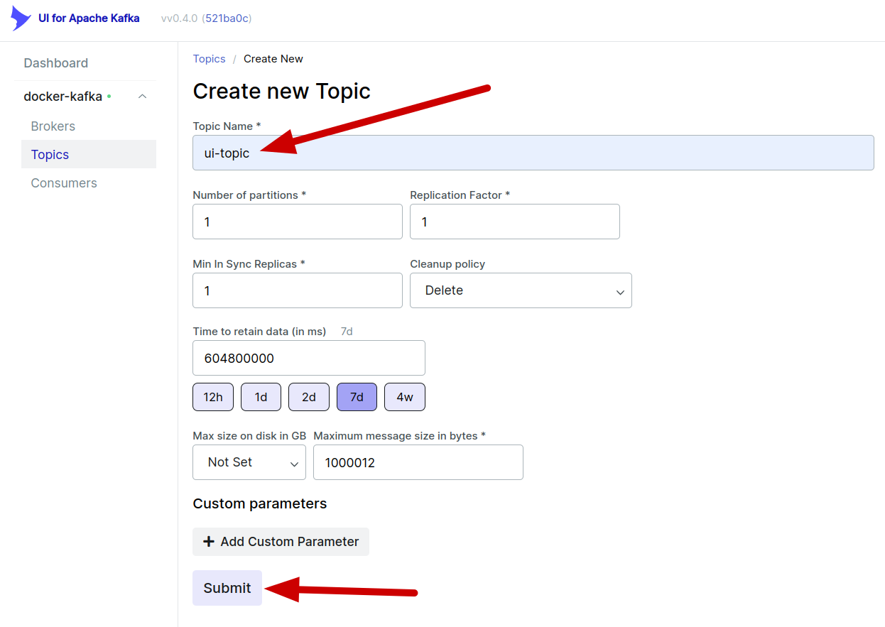
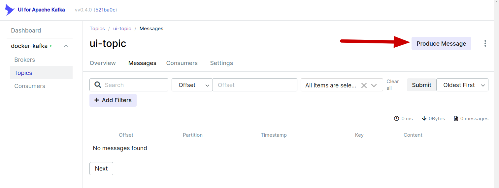
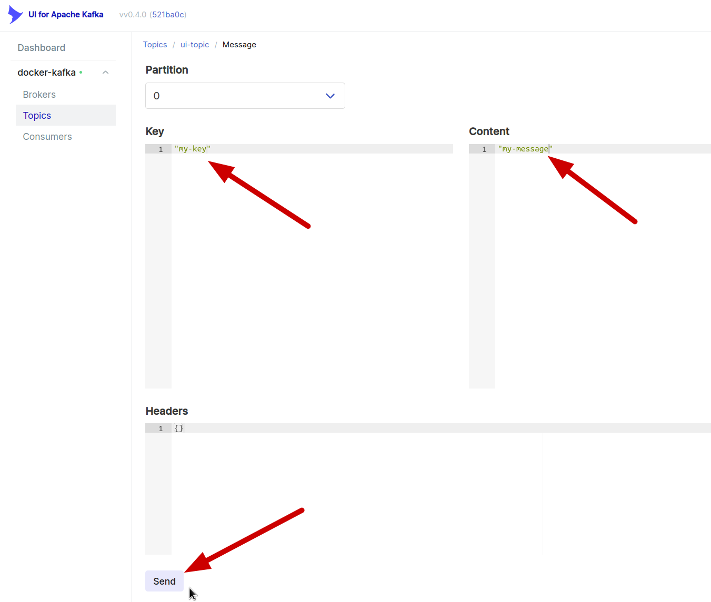
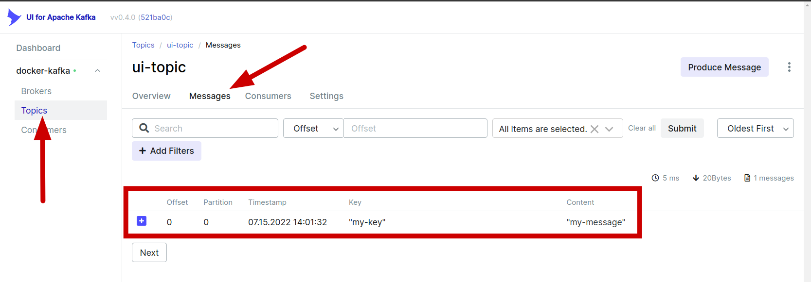

Run Kafka From Docker
---------------------
In this tutorial we are going to run a kafka cluster from a docker compose and explore some basic kafka commands. 


Prerequisites
-------------
Docker and docker compose installed in your computer.
See [docker engine installation](https://docs.docker.com/engine/install/).


Docker Compose
--------------
Download the [docker-compose.yml](./docker-compose.yml) to a folder in your computer.

**docker-compose.yml**
```yaml
version: '3'
services:
  # Configuration for Zookeper
  zookeeper:
    image: confluentinc/cp-zookeeper:7.0.1
    container_name: zookeeper
    environment:
      ZOOKEEPER_CLIENT_PORT: 2181
      ZOOKEEPER_TICK_TIME: 2000

  # Configuration for the Kafka Broker
  broker:
    image: confluentinc/cp-kafka:7.0.1
    # To learn about configuring Kafka for access across networks see
    # https://www.confluent.io/blog/kafka-client-cannot-connect-to-broker-on-aws-on-docker-etc/
    container_name: broker
    depends_on:
      - zookeeper
    ports:
      - "9092:9092"
    environment:
      KAFKA_BROKER_ID: 1
      KAFKA_ZOOKEEPER_CONNECT: 'zookeeper:2181'
      KAFKA_LISTENER_SECURITY_PROTOCOL_MAP: PLAINTEXT:PLAINTEXT,PLAINTEXT_INTERNAL:PLAINTEXT
      KAFKA_ADVERTISED_LISTENERS: PLAINTEXT://localhost:9092,PLAINTEXT_INTERNAL://broker:29092
      KAFKA_OFFSETS_TOPIC_REPLICATION_FACTOR: 1
      KAFKA_TRANSACTION_STATE_LOG_MIN_ISR: 1
      KAFKA_TRANSACTION_STATE_LOG_REPLICATION_FACTOR: 1

  # Configuration for Kafka UI. It can be accessed at: http://localhost:8088
  kafka-ui:
    image: provectuslabs/kafka-ui
    container_name: kafka-ui
    depends_on:
      - broker
    ports:
      - "8088:8080"
    environment:
      KAFKA_CLUSTERS_0_NAME: docker-kafka
      KAFKA_CLUSTERS_0_BOOTSTRAPSERVERS: broker:29092
      KAFKA_CLUSTERS_0_ZOOKEEPER: zookeeper:2181
```

On a terminal, start docker compose. You should see the logs in the current terminal.
```bash
docker compose -f docker-compose.yml up
```

Conversely, when we want to stop our cluster; on a different terminal, we can stop our docker compose with: 
```bash
docker compose -f docker-compose.yml stop
```

Kafka UI
--------
Our docker compose is configured with a Kafka UI which allows us to easily explore our kafka cluster via a GUI.

Navigate to http://localhost:8088



Go to _Topics_ session and click on _Add a Topic_:


Enter a name and click on _Submit_:


Go to _Topics_ session and click on the _Messages_ tab and click on _Produce Message_:


Enter a _key_, a _content_ and click on _send_:


Go back to _Topics_ session and click on the _Messages_ tab. We can see that our message listed.


Kafka Commands
--------------
On a different terminal, run an interactive bash from inside the kafka's broker container:

```bash
docker exec -it broker /bin/bash
```

At this point our terminal is connected to the broker and we can issue kafka commands.

#### Create a topic
Let's create a kafka topic named `cli-topic`:
```bash
kafka-topics --bootstrap-server broker:9092 \
    --create \
    --topic cli-topic
```

#### List topics
We can list the topics in our cluster:
```bash
kafka-topics --bootstrap-server broker:9092 \
    --list
```

#### Produce messages
We can produce messages to our cluster. In this example the key is `my-cli-key` and the content of the message is `my-cli-message`:
```bash
kafka-console-producer --bootstrap-server broker:9092 \
    --property "parse.key=true" --property "key.separator=:" \
    --topic cli-topic \
     <<< 'my-cli-key:my-cli-message'
```

#### Consume messages from a topic
We can consume messages from a topic and print to the terminal:
```bash
kafka-console-consumer --bootstrap-server broker:9092 \
    --property "print.key=true" \
    --topic cli-topic \
    --from-beginning
```

References
----------

Excellent article on Kafka networking:
_My Python/Java/Spring/Go/Whatever Client Won’t Connect to My Apache Kafka Cluster in Docker/AWS/My Brother’s Laptop. Please Help!_

https://www.confluent.io/blog/kafka-client-cannot-connect-to-broker-on-aws-on-docker-etc/

_Apache Kafka Quick Start_

https://developer.confluent.io/quickstart/kafka-docker/

